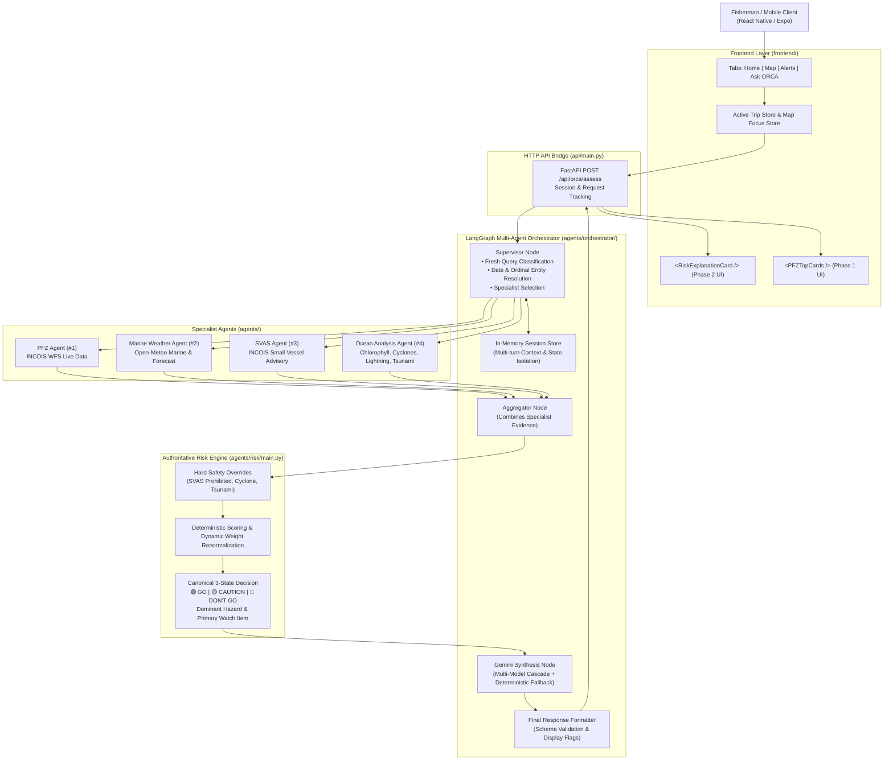
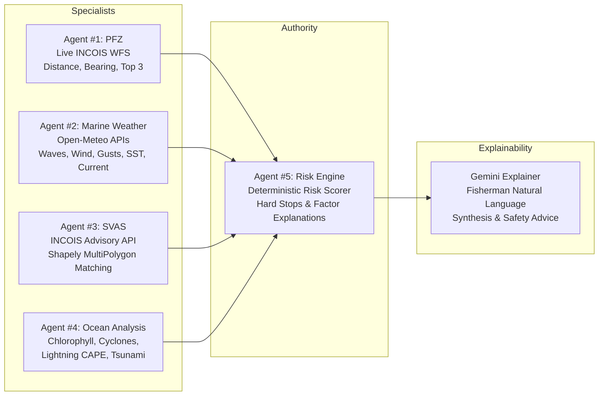
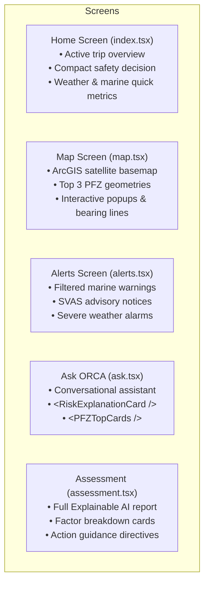

# ORCA – Marine Intelligence for Fishermen
## Comprehensive Project Context & Technical Architecture Guide

> **Document Purpose**: This document serves as the master architectural reference and project context for the **ORCA Marine Intelligence** platform. Any AI engineer or developer can read this document to gain complete, end-to-end understanding of the system's design, codebase structure, agent flows, mathematical models, API contracts, and implementation decisions without prior onboarding.

---

## Table of Contents
1. [Project Overview & Mission](#1-project-overview--mission)
2. [High-Level Architecture & Data Flow](#2-high-level-architecture--data-flow)
3. [Technology Stack](#3-technology-stack)
4. [Backend Architecture & API Bridge](#4-backend-architecture--api-bridge)
5. [Multi-Agent System & AI Specialists](#5-multi-agent-system--ai-specialists)
6. [Deterministic Risk Engine & Mathematical Models](#6-deterministic-risk-engine--mathematical-models)
7. [PFZ Recommendation & Geospatial Logic](#7-pfz-recommendation--geospatial-logic)
8. [Session Store & Conversational Multi-Turn Isolation](#8-session-store--conversational-multi-turn-isolation)
9. [Frontend Architecture (Expo / React Native)](#9-frontend-architecture-expo--react-native)
10. [Mapping & Satellite Visualization Layer](#10-mapping--satellite-visualization-layer)
11. [Environment Variables & Configuration](#11-environment-variables--configuration)
12. [Completed Features & Milestones](#12-completed-features--milestones)
13. [Key Implementation Decisions & Design Rationale](#13-key-implementation-decisions--design-rationale)
14. [Operational Considerations & Edge Cases](#14-operational-considerations--edge-cases)
15. [Future Roadmap & Next Phases](#15-future-roadmap--next-phases)

---

## 1. Project Overview & Mission

### Mission
**ORCA (Oceanic Risk Calculation & Advisory)** is an intelligent marine safety and productivity platform designed for artisanal and commercial fishermen operating along the Indian coastline. 

Fishermen navigate unpredictable maritime environments with limited real-time advisory access. ORCA bridges the gap between complex governmental oceanographic datasets and active sea operations by answering four core questions within **3 to 5 seconds**:
1. **Can I go?** — High-contrast, definitive 3-state decision (🟢 **GO** / 🟡 **CAUTION** / 🔴 **DON'T GO**).
2. **Why?** — Explainable breakdown of live environmental factors (waves, wind, gusts, currents, convective storms, vessel advisories) evaluated against boat dimensions.
3. **What is the main danger?** — Immediate identification of dominant hazards (e.g., active lightning, cyclonic squalls, high swamping risk).
4. **Where are the fish and how do I navigate safely?** — High-probability Potential Fishing Zones (PFZ) ranked with travel distance, bearing, and fuel considerations.

### Target Users & Operational Constraints
- **Vessel Categories**: Small traditional canoes (<4m), motorized FRP boats (4–6m), gillnetters/trawlers (6–7m), and deep-sea vessels (7m+).
- **Operating Environment**: High glare, wet screens, one-handed operation on rolling decks, intermittent cellular connectivity.
- **Critical Safety Constraint**: **Zero Hallucination for Life Safety**. Marine safety decisions must never depend on non-deterministic LLM output. All risk scoring, safety stops, and advisory thresholds are computed deterministically.

---

## 2. High-Level Architecture & Data Flow

ORCA is structured as a **Micro-Agentic Architecture** with a FastAPI HTTP bridge, a LangGraph multi-agent orchestrator, a deterministic Risk Engine, and a React Native / Expo mobile client:



---

## 3. Technology Stack

### Backend & Orchestration
- **Language**: Python 3.10+
- **API Framework**: FastAPI, Pydantic v2, Uvicorn
- **Agent Orchestration**: LangGraph, LangChain Core
- **LLM / Generative AI**: Google GenAI SDK (`google-genai`), Gemini 3.5 Flash Lite / 3.5 Flash / 3.7 Flash
- **Geospatial & Math**: Shapely (topological repair & union), NumPy, Requests, HTTPX, Math (Haversine distance & Great Circle bearings)
- **Testing**: Python `unittest`, Mocking, End-to-End API integration suites

### Frontend & Mobile
- **Framework**: React Native 0.76+, Expo SDK 52+
- **Routing**: Expo Router (file-based navigation with tab layouts and stack screens)
- **Language**: TypeScript 5.3+ (Strict Mode)
- **UI Components & Icons**: Lucide React Native, React Native Safe Area Context, React Native Reanimated
- **Maps**: 
  - **Web**: React-Leaflet + Leaflet raster layer
  - **Native**: MapLibre GL / WebView bridge with ArcGIS World Imagery Satellite Tiles
- **State & Storage**: React Hooks, `@react-native-async-storage/async-storage`, Custom In-Memory Pub/Sub Stores (`tripStore.ts`, `mapFocusStore.ts`)

---

## 4. Backend Architecture & API Bridge

### Entry Points & Core Files
- [`api/main.py`](file:///c:/Users/arfat/ORCA-Marine-Intelligence/api/main.py): FastAPI application exposing health check and assessment endpoints with CORS enabled.
- [`agents/orchestrator/main.py`](file:///c:/Users/arfat/ORCA-Marine-Intelligence/agents/orchestrator/main.py): Public Python entry points (`orchestrate_orca_assessment`, `run_orca`, `classify_query`).
- [`agents/orchestrator/graph.py`](file:///c:/Users/arfat/ORCA-Marine-Intelligence/agents/orchestrator/graph.py): Complete LangGraph StateGraph, supervisor routing, specialist execution, Gemini explanation, and response formatting.
- [`agents/orchestrator/session_store.py`](file:///c:/Users/arfat/ORCA-Marine-Intelligence/agents/orchestrator/session_store.py): Conversational memory store maintaining recent message windows, cached PFZ candidates, and entity references.

### API Endpoints

#### 1. `GET /health`
Returns service status:
```json
{
  "status": "ok",
  "service": "ORCA API"
}
```

#### 2. `POST /api/orca/assess`
Main assessment and conversational endpoint.

**Request Schema (`OrcaAssessRequest`)**:
```json
{
  "query": "Is it safe for me to go fishing today?",
  "latitude": 19.72,
  "longitude": 72.70,
  "date": "2026-09-08",
  "boat_width_m": 5.0,
  "request_id": "req-custom-uuid",
  "session_id": "sess-user-123",
  "conversation_history": [
    {"role": "user", "content": "Where is the nearest fishing zone?"},
    {"role": "assistant", "content": "The nearest PFZ is 14.2 km North-West."}
  ]
}
```

**Response Schema Highlights**:
```json
{
  "request_id": "req-custom-uuid",
  "assessment": {
    "status": "SAFE",
    "risk_score": 14,
    "summary": "Conditions are safe for a 5.0m vessel."
  },
  "risk_explanation": {
    "decision": "GO",
    "decision_label": "GO - Safe Marine Conditions",
    "decision_subtitle": "Conditions generally favourable for sailing",
    "risk_score": 14,
    "status": "SAFE",
    "dominant_hazard": null,
    "primary_thing_to_watch": "Ocean Current",
    "primary_thing_to_watch_reason": "Current velocity is 1.8 km/h (moderate drift).",
    "factors": [
      {
        "id": "current",
        "name": "Ocean Current",
        "value": 1.8,
        "unit": "km/h",
        "value_formatted": "1.8 km/h",
        "status": "caution",
        "status_label": "Moderate Drift",
        "impact": "moderate",
        "reason": "Current velocity is 1.8 km/h (moderate drift).",
        "is_critical": false
      },
      {
        "id": "waves",
        "name": "Wave Height",
        "value": 0.8,
        "unit": "m",
        "value_formatted": "0.8 m",
        "status": "safe",
        "status_label": "Low Impact (Calm Sea)",
        "impact": "low",
        "reason": "Wave height is 0.8 m. Within safe operating limits for your 5.0m vessel.",
        "is_critical": false
      }
    ],
    "action_guidance": {
      "headline": "What Should You Do?",
      "action_text": "Conditions are generally favourable for departure. Maintain standard navigation safety watch.",
      "urgency": "routine"
    },
    "vessel_evaluated": "5.0m Vessel Evaluated",
    "boat_width_m": 5.0,
    "data_quality": "good",
    "missing_factors": []
  },
  "pfz": {
    "available": true,
    "top_candidates": [
      {
        "id": "pfz-cand-1-1249",
        "rank": 1,
        "label": "PFZ 1",
        "name": "Potential Fishing Zone #1",
        "distance_km": 14.2,
        "bearing_degrees": 312.4,
        "direction": "NW",
        "coordinates": {"latitude": 19.82, "longitude": 72.59},
        "recommended": true,
        "recommendation_reason": "Recommended based on shortest travel distance (~14.2 km NW), minimizing transit time and fuel consumption."
      }
    ]
  },
  "display": {
    "pfz": false,
    "pfz_mode": "none",
    "risk_explanation": true,
    "map_action": false
  },
  "recommendation": "Marine conditions near Palghar Coast are safe for sailing today with calm seas (0.8m waves) and light wind (8 kt)."
}
```

---

## 5. Multi-Agent System & AI Specialists



### Agent #1: PFZ Specialist (`agents/pfz/main.py`)
- **Data Source**: Live INCOIS GeoServer WFS endpoint (`PFZ_Automation:pfzlines`).
- **Functionality**:
  - Fetches live GeoJSON LineString / MultiLineString features without caching.
  - **Freshness Filter**: Filters candidate lines by the latest `(Year, Julian_day)` present in the dataset to avoid mixing stale and fresh lines.
  - **Ranking**: Calculates Haversine distance and Great Circle compass bearing from the fisherman's GPS coordinate to every line vertex.
  - Groups points by distinct GeoJSON features and orders candidates into **Top 3 Distinct PFZs** (Rank 1: Recommended; Ranks 2 & 3: Alternatives with additional transit delta).

### Agent #2: Marine Weather Specialist (`agents/marine_weather/main.py`)
- **Data Sources**:
  - Open-Meteo Forecast API (`https://api.open-meteo.com/v1/forecast`): 10m wind speed, gusts, direction, 2m temperature, precipitation, weather code.
  - Open-Meteo Marine API (`https://marine-api.open-meteo.com/v1/marine`): Wave height, period, direction, sea surface temperature (SST), ocean current velocity and direction.
- **Normalization**: Standardizes units to knots (`kt`), meters (`m`), degrees (`°`), Celsius (`°C`), and kilometers per hour (`km/h`).

### Agent #3: SVAS Specialist (`agents/svas/main.py`)
- **Data Source**: Live INCOIS Small Vessel Advisory Service (`https://gemini.incois.gov.in/api/ws/latestsvasadvisory`).
- **Functionality**:
  - Evaluates official sailing advisories across coastal districts for three boat classes: `under_4m` (ENG4), `under_6m` (ENG6), `under_7m` (ENG7) over Day-1, Day-2, Day-3.
  - **Geospatial Robustness**: Solves government boundary topology bugs by unioning disjoint district features (`unary_union`) and applying topological self-intersection repair (`shape.buffer(0)`).

### Agent #4: Ocean Analysis Specialist (`agents/ocean_analysis/main.py`)
- **Data Sources**:
  - **Chlorophyll**: Copernicus Marine / Ocean color indices.
  - **Cyclones**: IMD / Joint Typhoon Warning Center active storm tracks.
  - **Lightning & Convection**: Convective Available Potential Energy (CAPE J/kg) and thunderstorm codes.
  - **Tsunami & Seismic**: INCOIS Tsunami Early Warning Center bulletin evaluations.

### Agent #5: Deterministic Risk Engine (`agents/risk/main.py`)
- **Sole Source of Truth**: Computes the 0–100 risk score, canonical decision (`GO`, `CAUTION`, `DONT_GO`), dominant hazard, and factor explanations.
- **Zero LLM Dependency**: Completely deterministic, unit-tested, and audited against maritime regulations.

### Gemini Synthesis Node (`agents/orchestrator/graph.py`)
- **Role**: Translates structured specialist evidence into concise, respectful, vernacular-friendly advice.
- **Resilience**: Employs a multi-model fallback cascade (`gemini-3.5-flash-lite` → `gemini-3.5-flash` → `gemini-3.7-flash` → `gemini-3.6-flash`). If all LLM calls fail or API keys are missing, a deterministic fallback template immediately formats the response without error.

---

## 6. Deterministic Risk Engine & Mathematical Models

### 1. Hard Safety Overrides (Priority 1)
Before running weighted calculations, the Risk Engine evaluates non-negotiable safety stops:
1. **Official SVAS Prohibition**: If INCOIS SVAS advisory states "should not sail", "operations not recommended", or severity is `danger` for the vessel's width category $\rightarrow$ **Score: 100**, **Decision: DON'T GO**.
2. **Active Tropical Cyclone**: If an active cyclone warning intersects the maritime zone $\rightarrow$ **Score: 100**, **Decision: DON'T GO**.
3. **Active Tsunami / Seismic Alert**: If an active tsunami bulletin or high-magnitude seismic threat is present $\rightarrow$ **Score: 100**, **Decision: DON'T GO**.

### 2. Base Weights & Dynamic Renormalization
When no hard stop is triggered, the Risk Engine evaluates available environmental variables using standard base weights $W_{\text{base}}$:

| Environmental Factor | Metric | Base Weight ($W_i$) | Risk Score Mapping ($R_i$) |
| :--- | :--- | :--- | :--- |
| **Wave Height** | Significant Wave Height ($m$) | $0.35$ | $<1.0\text{m} \rightarrow 0$<br>$1.0\text{–}2.0\text{m} \rightarrow 35$<br>$2.0\text{–}3.0\text{m} \rightarrow 70$<br>$\ge 3.0\text{m} \rightarrow 100$ |
| **Wind Speed** | Sustained 10m Wind ($\text{kt}$) | $0.20$ | $<10\text{kt} \rightarrow 0$<br>$10\text{–}20\text{kt} \rightarrow 30$<br>$20\text{–}30\text{kt} \rightarrow 70$<br>$\ge 30\text{kt} \rightarrow 100$ |
| **Wind Gusts** | Peak 10m Gusts ($\text{kt}$) | $0.15$ | $<15\text{kt} \rightarrow 0$<br>$15\text{–}25\text{kt} \rightarrow 30$<br>$25\text{–}35\text{kt} \rightarrow 70$<br>$\ge 35\text{kt} \rightarrow 100$ |
| **Ocean Current** | Surface Velocity ($\text{km/h}$) | $0.10$ | $<1.0\text{km/h} \rightarrow 0$<br>$1.0\text{–}2.0\text{km/h} \rightarrow 30$<br>$2.0\text{–}3.0\text{km/h} \rightarrow 70$<br>$\ge 3.0\text{km/h} \rightarrow 100$ |
| **Convective / Lightning** | CAPE / Storm Code | $0.10$ | Clear $\rightarrow 0$<br>Elevated CAPE $\rightarrow 50$<br>Active Storm $\rightarrow 100$ |
| **Other Ocean Hazards** | Warnings / Bulletins | $0.10$ | None $\rightarrow 0$<br>Advisories $\rightarrow 50$<br>Critical Hazard $\rightarrow 100$ |

#### Dynamic Weight Renormalization Formula
If any factor $k$ is missing from upstream feeds, the available factor weights are dynamically renormalized so that the sum of effective weights always equals $1.0$:

$$W_i^{\text{effective}} = \frac{W_i}{\sum_{j \in \text{Available}} W_j}$$

$$\text{Final Risk Score} = \text{round}\left( \sum_{i \in \text{Available}} W_i^{\text{effective}} \times R_i \right)$$

### 3. Canonical Decision & Primary Watch Logic
- **Score $0 \le S \le 29$**: 🟢 **GO** (`decision: "GO"`).
  - *Secondary Watch Item*: If a minor factor has caution status (e.g. current at 1.8 km/h), the decision remains **GO**, and `primary_thing_to_watch: "Ocean Current"` is populated.
- **Score $30 \le S \le 59$** (or multiple caution factors with $S \ge 25$): 🟡 **CAUTION** (`decision: "CAUTION"`).
  - *Dominant Hazard*: Surfaces the leading contributing hazard (e.g. "Wave Height" or "Wind Speed").
- **Score $60 \le S \le 100$** (or any critical danger factor): 🔴 **DON'T GO** (`decision: "DONT_GO"`).
  - *Dominant Hazard*: Surfaces the critical danger posing immediate risk to life or craft.

### 4. Missing Data Principle ("Never Safe")
If an environmental feed fails, that factor is categorized as `unavailable` (⚪ **NO DATA**). **Missing data is never treated as 0 risk or safe**. A warning banner notifies the fisherman of degraded data quality.

---

## 7. PFZ Recommendation & Geospatial Logic

### Haversine Distance & Compass Bearing Calculation
Given user location $(\text{lat}_1, \text{lon}_1)$ and PFZ vertex $(\text{lat}_2, \text{lon}_2)$ with Earth radius $R = 6371.0\text{ km}$:

$$\Delta\text{lat} = \text{radians}(\text{lat}_2 - \text{lat}_1), \quad \Delta\text{lon} = \text{radians}(\text{lon}_2 - \text{lon}_1)$$

$$a = \sin^2\left(\frac{\Delta\text{lat}}{2}\right) + \cos(\text{radians}(\text{lat}_1))\cos(\text{radians}(\text{lat}_2))\sin^2\left(\frac{\Delta\text{lon}}{2}\right)$$

$$d = 2 R \cdot \text{atan2}\left(\sqrt{a}, \sqrt{1 - a}\right)$$

**Compass Bearing ($\theta$)**:

$$x = \sin(\Delta\text{lon})\cos(\text{radians}(\text{lat}_2))$$

$$y = \cos(\text{radians}(\text{lat}_1))\sin(\text{radians}(\text{lat}_2)) - \sin(\text{radians}(\text{lat}_1))\cos(\text{radians}(\text{lat}_2))\cos(\Delta\text{lon})$$

$$\theta = (\text{degrees}(\text{atan2}(x, y)) + 360) \pmod{360}$$

### Top 3 Candidate Ranking & Selection
1. **Rank 1 (Recommended)**: Nearest candidate zone minimizing fuel consumption and transit time.
2. **Rank 2 & 3 (Alternatives)**: Secondary distinct fishing lines providing options if coastal conditions vary.
3. **Conversational Follow-ups**: Queries such as *"show the 2nd one on map"* or *"how far is the 3rd zone?"* resolve ordinal numbers to cached candidate features without making redundant WFS requests.

---

## 8. Session Store & Conversational Multi-Turn Isolation

### Architecture (`agents/orchestrator/session_store.py`)
To ensure seamless multi-turn conversations without state leakage, ORCA maintains bounded in-memory sessions:

```python
{
    "session_id": "sess-user-123",
    "messages": [ /* Last 12 messages bounded */ ],
    "last_intent": "pfz_query",
    "last_action": "query",
    "last_entity": "pfz",
    "last_entity_rank": 1,
    "last_pfz_candidates": [ /* Top 3 PFZ objects */ ],
    "last_location": {"latitude": 19.72, "longitude": 72.70},
    "updated_at": 1725800000.0
}
```

### Strict State Isolation Rules
1. **Fresh Intent on Every Query**: Every incoming user prompt undergoes fresh classification before reading conversational context.
2. **Context Activation on Anaphora Only**: Contextual memory (e.g. `last_pfz_candidates`, `last_entity_rank`) is accessed **only** when the user prompt contains explicit anaphora or pronouns (*"it"*, *"that one"*, *"the second zone"*, *"show in map"*).
3. **Zero State Leakage**: Unrelated queries (*"Are the waves safe for a 5m boat?"*, *"What is the capital of India?"*) execute with fresh state, producing zero PFZ cards or stale entity leaks.

---

## 9. Frontend Architecture (Expo / React Native)

### Directory Layout
```
frontend/
├── app/
│   ├── (tabs)/
│   │   ├── _layout.tsx         # Tab navigation with custom bottom bar
│   │   ├── index.tsx           # Home Screen (Trip context, compact risk hero, conditions)
│   │   ├── map.tsx             # Interactive Map Screen (Satellite tiles, PFZs, markers)
│   │   ├── alerts.tsx          # Alerts & Marine Warnings Screen
│   │   └── ask.tsx             # Ask ORCA Conversational Screen (Explainable AI & PFZs)
│   ├── _layout.tsx             # Root layout with SafeAreaProvider and Theme
│   └── assessment.tsx          # Detailed Trip Risk Assessment View
├── components/
│   ├── map/
│   │   ├── OrcaMapComponent.tsx        # Cross-platform map interface
│   │   ├── OrcaMapComponent.web.tsx    # Leaflet satellite map implementation
│   │   └── OrcaMapComponent.native.tsx # Native satellite map implementation
│   ├── BoatSizeSelector.tsx    # Vessel width picker (<4m, 4-6m, 6-7m, 7m+)
│   ├── BottomTabBar.tsx        # Custom elevated dark-mode bottom tab bar
│   ├── DateSelector.tsx        # Fishing date selection picker
│   ├── LocationSelector.tsx    # Preset & custom coastal coordinate selector
│   ├── MarineConditionsCard.tsx# Live wave, wind, current, SST metric grid
│   ├── OrcaHeader.tsx          # App header with connection status & quick selectors
│   ├── PFZCard.tsx             # Single PFZ detail card
│   ├── PFZTopCards.tsx         # Horizontal Top 3 PFZ candidate carousel
│   ├── ResponsiveContainer.tsx # Mobile/tablet responsive wrapper
│   ├── RiskCard.tsx            # Compact Home screen risk banner
│   ├── RiskExplanationCard.tsx # Phase 2 Visual Explainable AI Hero Card
│   └── SVASCard.tsx            # Official INCOIS SVAS advisory badge
├── constants/
│   ├── locations.ts            # Indian coastal presets (Palghar, Mumbai, Goa, Kochi, etc.)
│   ├── map.ts                  # ArcGIS World Imagery satellite tile URLs & styles
│   └── theme.ts                # Deep oceanic dark theme colors, spacing, shadows
├── services/
│   ├── api.ts                  # HTTP API client connecting to /api/orca/assess
│   ├── mapFocusStore.ts        # Pub/Sub store for cross-tab map navigation actions
│   └── tripStore.ts            # Centralized active trip context store with AsyncStorage
└── types/
    └── orca.ts                 # TypeScript data contracts matching backend models
```

### Global State Management
1. **Active Trip Store (`tripStore.ts`)**:
   - Stores current location coordinates, fishing date, and vessel size.
   - Synchronizes across Home, Map, Alerts, Ask ORCA, and Assessment tabs.
   - Automatically hydrates from and persists to `AsyncStorage`.
2. **Map Focus Store (`mapFocusStore.ts`)**:
   - Enables chat and card actions (e.g. clicking *"Show on Map"*) to smoothly navigate to the Map tab and fly camera coordinates to the target feature.

### Screen & UI Responsibilities



---

## 10. Mapping & Satellite Visualization Layer

### Real Satellite Map Tiles
ORCA uses **ArcGIS World Imagery Satellite Tiles** for true geographical fidelity:
- **Tile URL**: `https://services.arcgisonline.com/ArcGIS/rest/services/World_Imagery/MapServer/tile/{z}/{y}/{x}`
- **Attribution**: *Tiles © Esri — Source: Esri, i-cubed, USDA, USGS, AEX, GeoEye, Getmapping, Aerogrid, IGN, IGP, UPR-EGP, and the GIS User Community.*

### Map Layers & Features
1. **User Vessel Location**: High-contrast blue boat icon with pulse animation.
2. **PFZ Geometries**: Emerald green (`#10B981`) polylines and polygons rendered from live GeoJSON coordinates.
3. **Directional Flow Arrows**: Yellow orientation markers along PFZ lines indicating orientation and current flow.
4. **Distance Line**: Dashed yellow trajectory line connecting user coordinates to the nearest PFZ with distance badge.
5. **Interactive Popups**: Displays sector name, year, Julian day, length, and UID.

---

## 11. Environment Variables & Configuration

Backend and frontend configuration options:

### Backend Environment Variables (`.env`)

| Variable Name | Required | Default | Description |
| :--- | :--- | :--- | :--- |
| `GEMINI_API_KEY` | Optional | `None` | Google Gemini API key for conversational synthesis. If omitted, deterministic fallbacks are used. |
| `GEMINI_MODEL` | Optional | `gemini-3.5-flash-lite` | Primary Gemini model ID for response synthesis. |
| `GEMINI_FALLBACK_MODELS` | Optional | `gemini-3.5-flash-lite,gemini-3.5-flash,gemini-3.7-flash,gemini-3.6-flash` | Comma-separated cascade of fallback models if primary model errors. |
| `GEMINI_RETRIES` | Optional | `2` | Maximum retry attempts per model before escalating down cascade. |
| `GEMINI_RETRY_DELAY` | Optional | `2.0` | Delay in seconds between retries. |
| `SSL_CERT_FILE` | Optional | `certifi.where()` | Path to CA certificates bundle for network requests. |

### Frontend Environment Variables

| Variable Name | Required | Default | Description |
| :--- | :--- | :--- | :--- |
| `EXPO_PUBLIC_API_URL` | Optional | `http://localhost:8000` | Backend API base URL for mobile and web network requests. |

---

## 12. Completed Features & Milestones

### Phase 1: Conversational Orchestration & State Isolation (Completed)
- ✅ **Strict Query State Isolation**: Fresh intent classification on every query to eliminate context bleed.
- ✅ **Top 3 Distinct PFZ Ranking**: Distance, bearing, and fuel-efficiency recommendations.
- ✅ **Ordinal Follow-Up Resolution**: Support for queries like *"show 2nd nearest on map"*.
- ✅ **Display Relevance Flags**: Independent control for `display.pfz` and `display.risk_explanation`.
- ✅ **Per-Message Card Rendering**: PFZ cards and risk cards bound to specific chat messages.

### Phase 2: Visual Explainable AI & Single Decision Unification (Completed)
- ✅ **Single Authoritative Decision**: 🟢 **GO** / 🟡 **CAUTION** / 🔴 **DON'T GO** hero banner governed strictly by the Risk Engine.
- ✅ **Primary Thing to Watch**: Displays subtle caution items (e.g. moderate ocean currents) without triggering false overall CAUTION alarms when risk score is low.
- ✅ **Factor Breakdown Cards**: Visual status badges (🟢 Safe, 🟡 Caution, 🔴 Danger, ⚪ No Data) with practical interpretations and boat size evaluations.
- ✅ **No Duplicate Text Output**: Clean conversational advice without prepended raw status strings.
- ✅ **Missing Data Protocol**: Explicit `unavailable` labeling for offline feeds.

### UI/UX & Platform Redesign (Completed)
- ✅ **Dark Maritime Design System**: High-contrast, sunlight-readable palette (`#030D1A`, `#0B1E36`, `#00E5FF`).
- ✅ **Active Trip Synchronization**: Reactive `tripStore` synchronizing coordinates, date, and boat size across all screens.
- ✅ **ArcGIS Satellite Mapping**: True satellite tiles with directional PFZ rendering and Leaflet/MapLibre bridges.
- ✅ **Responsive Containers**: Seamless support for web, mobile, and tablet viewports.

---

## 13. Key Implementation Decisions & Design Rationale

1. **Why Deterministic Risk Engine instead of LLM?**
   - *Rationale*: Safety at sea is mission-critical. LLMs are susceptible to hallucinations, variable scoring, and non-deterministic logic. The deterministic Risk Engine ensures that identical oceanographic parameters produce identical safety decisions and strict adherence to governmental advisories.

2. **Why Separate Contextual Memory from Current Query Intent?**
   - *Rationale*: In early iterations, asking *"What is the capital of India?"* after asking for PFZs caused the model to return the 2nd PFZ again. Fresh deterministic classification ensures that general or safety queries are never contaminated by prior PFZ context.

3. **Why ArcGIS World Imagery over Standard OSM Tiles?**
   - *Rationale*: OpenStreetMap standard tiles lack ocean floor texture, coastal reefs, and maritime features. Satellite imagery enables fishermen to visually recognize coastal headlands, river mouths, and reef formations.

4. **Why Dynamic Weight Renormalization for Missing Data?**
   - *Rationale*: If satellite current data or radar lightning data is temporarily offline, simply dropping the weight would artificially deflate the risk score. Renormalizing ensures the remaining factors represent 100% of the evaluated evidence while flagging missing data.

---

## 14. Operational Considerations & Edge Cases

1. **INCOIS Upstream Outages & Network Timeouts**:
   - The PFZ and SVAS agents enforce a 20-second timeout. If the INCOIS GeoServer returns HTTP errors or non-JSON payloads, agents fail gracefully to `status: "unavailable"` without crashing the orchestrator.
2. **Topological Self-Intersections in Coastal Districts**:
   - Government GeoJSON exports frequently contain self-intersecting polygon rings. The SVAS agent applies `shapely.ops.unary_union` and `shape.buffer(0)` to repair geometry before point-in-polygon queries.
3. **SSL Certificates in Windows / Sandbox Environments**:
   - Backend initialization automatically configures `certifi.where()` and disables insecure certificate warnings when connecting to legacy government servers.
4. **Local Timezone vs Target Fishing Date**:
   - Date terms like *"tomorrow"* or *"day after tomorrow"* are resolved against the request's requested fishing date rather than the backend server's internal clock.

---

## 15. Future Roadmap & Next Phases

- [ ] **Phase 3: Route Optimization & Fuel-Smart Navigation**
  - Dijkstra / A* maritime routing algorithms navigating around shallow reefs, hazardous swell zones, and maritime boundaries.
  - Estimated fuel consumption (liters) and transit time based on vessel hull type and engine horsepower.
- [ ] **Phase 4: Offline Mesh Networking & SMS Fallback**
  - Compact binary encoding for risk advisories and PFZ coordinates transmitted via low-bandwidth satellite SMS or VHF radio mesh.
- [ ] **Phase 5: Vernacular Voice & Multilingual Audio Synthesis**
  - Speech-to-Text and Text-to-Speech support for coastal Indian languages (Marathi, Tamil, Malayalam, Telugu, Bengali, Gujarati, Odia).
- [ ] **Phase 6: Catch Logbook & Community Marine Hazard Reporting**
  - Fisherman logbook recording catch volume, species caught, and crowdsourced hazard reporting (e.g., floating debris, lost nets, localized squalls).

---
*Document maintained by the ORCA Marine Intelligence Engineering Team.*
